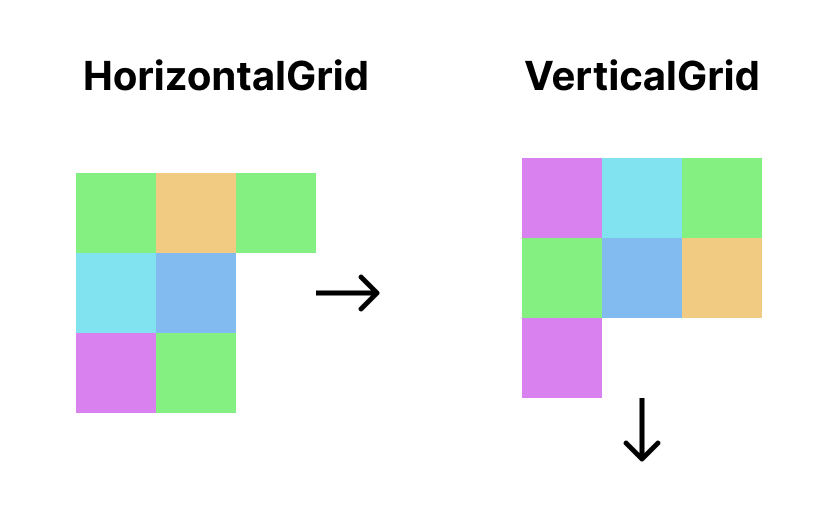
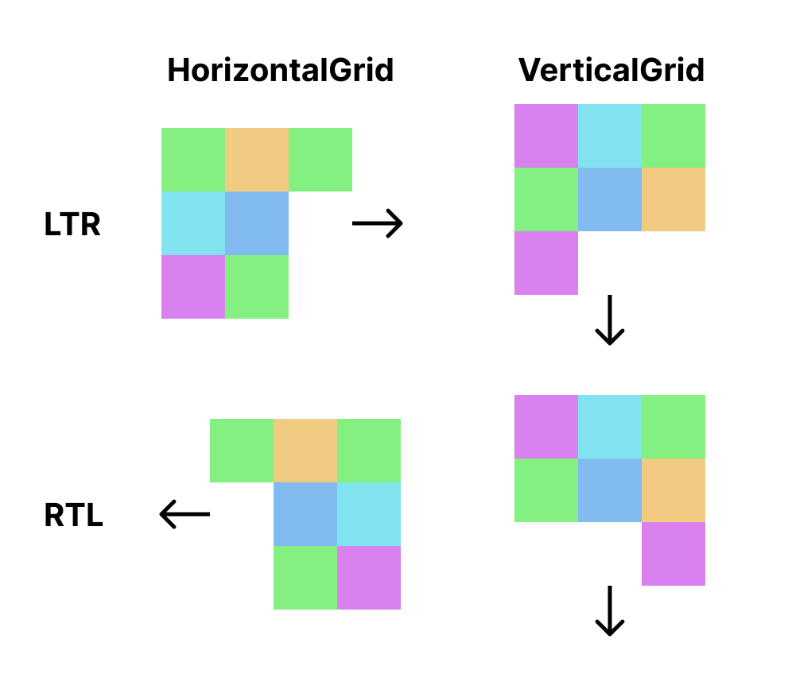

# Layout Composables

GridLayout library provides a simple API to make grid UI.
And also this library's grids have similar API to lazy grids.
If you have used LazyGrid, you can use this library more easily.



Basically, there are 2 composables to make grid, `HorizontalGrid` and `VerticalGrid`.
`HorizontalGrid` is a grid layout composable that increases its width as items increases
and `VerticalGrid` increases its height as items increases.

The following sample code shows how to use these grid layout composables.

```kotlin
HorizontalGrid(
    rows = SimpleGridCells.Fixed(3),
    modifier = Modifier.fillMaxHeight()
) {
    Item()
    Item()
    Item()
}

VerticalGrid(
    columns = SimpleGridCells.Fixed(3),
    modifier = Modifier.fillMaxWidth()
) {
    Item()
    Item()
    Item()
}
```

!!! note
    You can see `rows` and `columns` parameter for `HorizontalGrid` and `VerticalGrid`.
    This parameter is required parameter for grid layout.
    For details, see [cell strategy](./cell-strategy.md) section.

## RTL (Right to Left) Supports



GridLayout supports RTL layout direction. Grids check current layout direction and places items by
direction.

If you want to apply a specified layout direction manually, wrap grid layout with `CompositionLocalProvider` and
provide `LocalLayoutDirection` like following code:

```kotlin
CompositionLocalProvider(LocalLayoutDirection provides LayoutDirection.Rtl) {
    HorizontalGrid(
        rows = SimpleGridCells.Fixed(3),
        modifier = Modifier.fillMaxHeight()
    ) { /* content */ }
}
```
